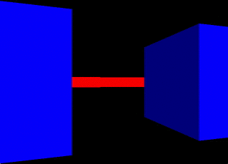

# Lode-Raycaster-SDL2
A port of the tutorial from lodev.org/cgtutor/raycasting.html into SDL2

All credit for quickcp and this raycasting code goes to Lode Vandevenne!  

The tutorial was designed to be used with quickcg http://lodev.org/quickcg/ but sadly that hasn't been updated to SDL2 as far as i know. 

I'm currently in the process of converting QuickCG to SDL2 in a project called InstantCG which you can check out here https://github.com/Cyphre117/InstantCG

To get up to speed with SDL2 I suggest checking out:  
http://lazyfoo.net/tutorials/SDL/  
http://www.willusher.io/pages/sdl2/

